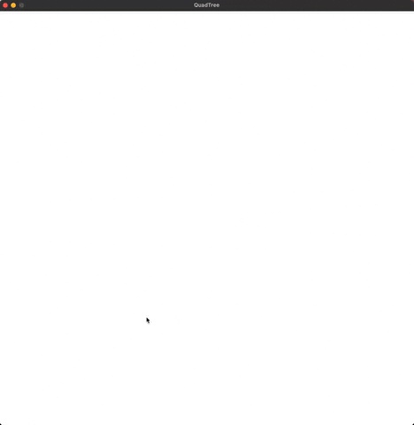

# quadtree
QuadTree implementation with visualization.

Controls:
  - LEFT MOUSE CLICK to add rectangles to quad tree.
  - HOLD 's' to visualize searching. Default shape is rectangle. HOLD 's' + LEFT SHIFT to change it to circle while searching.
  - HOLD 'r' to remove elements from quad tree. Default shape is rectangle. HOLD 'r' + LEFT SHIFT to change it to circle while removing.
  - 'd' to toggle debugging of quadtree areas.
  - 'x' to reset quad tree.

